# CheckTree - Issue Dependency Graph (Optimized v3.5)

## Overview

This document visualizes the issue dependency graph for AI-Me Behavior Management System using Mermaid diagrams. Each issue is a node, and arrows indicate dependencies (prerequisites).

**Optimization Changes (v3.5):**
- **新增项目初始化模块**: 添加 INIT 模块（5 issues），包含项目初始化父 Issue 和 PROJECT.md、TECH_STACK.md、ARCHITECTURE.md、CONCEPTS.md 四个规格文档子 Issue
- **文件夹结构重构**: issue 从扁平 YAML 迁移到 `issues/ISSUE-{ID}/` 文件夹结构，每个 issue 内含 `issue.yaml` + `tasks/` 目录
- **新增 Task 系统**: 每个 Claude Code session 对应一个 task YAML 文件，支持父子 task 关系

**Optimization Changes (v3.4):**
- **修复循环依赖**: 移除 UI-006 --> UI-001
- **优化依赖关系**: 添加缺失依赖，移除冗余依赖，缩短MVP关键路径
- **拆分复杂Issue**: UI-004拆分为4个, INFRA-006拆分为2个, CLI-011拆分为3个
- **新增性能监控模块**: 添加PERF(4 issues)、MON(3 issues)、DEV(3 issues)
- **新增Core/CLI/Security/Deployment issues**: CORE-018/019, CLI-012/013, SEC-005/006, DEPLOY-005/006
- **新增Alpha里程碑**: MS-1.5~alpha-release

**Optimization Changes (v3.3):**
- **新增UI模块**: 添加Web客户端界面系统，包含行为树可视化、仪表盘、智能推荐等6个issue

**Optimization Changes (v3.2):**
- **架构对齐**: 添加 Validation Layer、Repository Pattern、Dependency/Criteria/Tag 等遗漏模块
- **粒度优化**: 拆分复杂 issues (CORE-002B, CORE-003, CORE-010, PLUGIN-001)
- **Issue 合并**: CLI-007+013, CLI-011+012, SEC-004+005
- **Security 简化**: SEC-002 RBAC → user-identity (单机工具)
- **测试策略**: 对齐 SOP，增加 E2E/AI 测试要求
- **文档扩充**: 增加开发者文档、故障排除、ADR

Issue name rule: ISSUE-{Module}-{NUMBER}~{slug}

## Legend

| Symbol | Meaning |
|--------|---------|
| ✅ | Completed |
| 🔄 | In Progress |
| ⏳ | Pending |
| 🔴 | Blocked |

---

## Issue Dependency Graph

```mermaid
flowchart TD
    subgraph Init["📋 Project Initialization"]
        INIT000[⏳ ISSUE-INIT-000~project-init<br/>项目初始化（父 Issue）]
        INIT000A[⏳ ISSUE-INIT-000-A~create-project-spec<br/>创建 PROJECT.md]
        INIT000B[⏳ ISSUE-INIT-000-B~create-tech-stack<br/>创建 TECH_STACK.md]
        INIT000C[⏳ ISSUE-INIT-000-C~create-architecture<br/>创建 ARCHITECTURE.md]
        INIT000D[⏳ ISSUE-INIT-000-D~create-concepts<br/>创建 CONCEPTS.md]
    end

    subgraph Security["🔒 Security Module"]
        SEC001[⏳ ISSUE-SEC-001~auth-system<br/>用户认证系统]
        SEC002[⏳ ISSUE-SEC-002~user-identity<br/>用户身份标识]
        SEC003[⏳ ISSUE-SEC-003~data-encryption<br/>数据加密存储]
        SEC004[⏳ ISSUE-SEC-004~security-audit<br/>安全审计与 API 安全]
        SEC005[⏳ ISSUE-SEC-005~input-sanitization<br/>输入净化与防注入]
        SEC006[⏳ ISSUE-SEC-006~vulnerability-scan<br/>依赖漏洞扫描]
    end

    subgraph Infrastructure["🏗️ Infrastructure"]
        INFRA001[⏳ ISSUE-INFRA-001~project-setup<br/>项目初始化和仓库搭建]
        INFRA002[⏳ ISSUE-INFRA-002~directory-structure<br/>目录结构定义和实现]
        INFRA003A[⏳ ISSUE-INFRA-003A~schema-design<br/>数据库 Schema 设计]
        INFRA003B[⏳ ISSUE-INFRA-003B~schema-impl<br/>数据库 Schema 实现]
        INFRA004[⏳ ISSUE-INFRA-004~build-system<br/>构建系统和开发环境配置]
        INFRA005[⏳ ISSUE-INFRA-005~config-system<br/>配置管理系统]
        INFRA006A[⏳ ISSUE-INFRA-006A~error-handling<br/>错误处理系统]
        INFRA006B[⏳ ISSUE-INFRA-006B~logging-system<br/>日志系统]
        INFRA007[⏳ ISSUE-INFRA-007~test-infrastructure<br/>测试基础设施]
        INFRA008[⏳ ISSUE-INFRA-008~backup-restore<br/>数据库备份与恢复]
        INFRA009[⏳ ISSUE-INFRA-009~cache-layer<br/>缓存层]
        INFRA010[⏳ ISSUE-INFRA-010~ops-support<br/>运维支持工具]
        INFRA011[⏳ ISSUE-INFRA-011~db-migration<br/>数据库迁移工具]
        INFRA012[⏳ ISSUE-INFRA-012~install-script<br/>安装脚本]
        INFRA013[⏳ ISSUE-INFRA-013~validation-layer<br/>验证层]
        INFRA014[⏳ ISSUE-INFRA-014~repository-pattern<br/>Repository 模式]
    end

    subgraph Core["🔧 Core Module"]
        CORE001[⏳ ISSUE-CORE-001~behavior-entity<br/>Behavior 实体和类型定义]
        CORE002A[⏳ ISSUE-CORE-002A~behavior-create<br/>Behavior Create 服务]
        CORE002B1[⏳ ISSUE-CORE-002B1~basic-query<br/>基础查询服务]
        CORE002B2[⏳ ISSUE-CORE-002B2~advanced-query<br/>高级查询服务]
        CORE002C[⏳ ISSUE-CORE-002C~behavior-update<br/>Behavior Update 服务]
        CORE002D[⏳ ISSUE-CORE-002D~behavior-delete<br/>Behavior Delete 服务]
        CORE003A[⏳ ISSUE-CORE-003A~tree-build<br/>树构建与基础操作]
        CORE003B[⏳ ISSUE-CORE-003B~tree-traverse<br/>树遍历与查询]
        CORE003C[⏳ ISSUE-CORE-003C~tree-move<br/>树节点移动与重建]
        CORE004[⏳ ISSUE-CORE-004~status-management<br/>状态管理服务]
        CORE005[⏳ ISSUE-CORE-005~time-tracking<br/>时间追踪和聚合]
        CORE006[⏳ ISSUE-CORE-006~data-validation<br/>数据验证与完整性]
        CORE007A[⏳ ISSUE-CORE-007A~basic-search<br/>基础搜索服务]
        CORE007B[⏳ ISSUE-CORE-007B~advanced-search<br/>高级搜索服务]
        CORE008[⏳ ISSUE-CORE-008~batch-operations<br/>批量操作服务]
        CORE009[⏳ ISSUE-CORE-009~notification-service<br/>通知服务]
        CORE010A[⏳ ISSUE-CORE-010A~analytics-data<br/>数据统计聚合]
        CORE010B[⏳ ISSUE-CORE-010B~analytics-report<br/>报告生成引擎]
        CORE010C[⏳ ISSUE-CORE-010C~analytics-export<br/>分析报告导出]
        CORE011[⏳ ISSUE-CORE-011~event-system<br/>事件系统基础]
        CORE012[⏳ ISSUE-CORE-012~undo-redo<br/>撤销/重做机制]
        CORE013A[⏳ ISSUE-CORE-013A~data-export<br/>数据导出功能]
        CORE013B[⏳ ISSUE-CORE-013B~data-import<br/>数据导入功能]
        CORE013C[⏳ ISSUE-CORE-013C~data-format<br/>格式转换器]
        CORE014[⏳ ISSUE-CORE-014~dependency-mgmt<br/>依赖管理]
        CORE015[⏳ ISSUE-CORE-015~criteria-mgmt<br/>验收标准管理]
        CORE016[⏳ ISSUE-CORE-016~tag-system<br/>标签系统]
        CORE017[⏳ ISSUE-CORE-017~transaction-mgmt<br/>事务管理]
        CORE018[⏳ ISSUE-CORE-018~data-archiving<br/>数据归档与压缩]
        CORE019[⏳ ISSUE-CORE-019~data-quality-check<br/>数据质量检查]
    end

    subgraph Workspace["📁 Workspace Module"]
        WS001[⏳ ISSUE-WS-001~workspace-core<br/>工作空间核心服务]
        WS002A[⏳ ISSUE-WS-002A~folder-mgmt<br/>文件夹管理]
        WS002B[⏳ ISSUE-WS-002B~file-assoc<br/>文件关联管理]
        WS003[⏳ ISSUE-WS-003~workspace-switch<br/>工作空间切换]
        WS004[⏳ ISSUE-WS-004~file-versioning<br/>文件版本控制]
        WS005[⏳ ISSUE-WS-005~workspace-cleanup<br/>工作空间清理]
    end

    subgraph BehaviorClass["🧩 Behavior Class Module"]
        BC001[⏳ ISSUE-BC-001~class-definition<br/>行为类定义格式]
        BC002[⏳ ISSUE-BC-002~class-loader<br/>行为类加载器]
        BC003[⏳ ISSUE-BC-003~folder-template<br/>类文件夹模板系统]
        BC004[⏳ ISSUE-BC-004~class-inheritance<br/>行为类继承和组合]
        BC005[⏳ ISSUE-BC-005~class-versioning<br/>行为类版本管理]
        BC006[⏳ ISSUE-BC-006~class-registry<br/>行为类注册表]
    end

    subgraph CLI["💻 CLI Module"]
        CLI001A[⏳ ISSUE-CLI-001A~arg-parser<br/>参数解析器]
        CLI001B[⏳ ISSUE-CLI-001B~cmd-router<br/>命令路由系统]
        CLI002[⏳ ISSUE-CLI-002~behavior-commands<br/>行为管理命令]
        CLI003[⏳ ISSUE-CLI-003~tree-commands<br/>树操作命令]
        CLI004[⏳ ISSUE-CLI-004~workspace-class-cmds<br/>工作空间和类命令]
        CLI006A[⏳ ISSUE-CLI-006A~interactive-framework<br/>交互式框架基础]
        CLI006B1[⏳ ISSUE-CLI-006B1~interactive-behavior<br/>行为交互式命令]
        CLI006B2[⏳ ISSUE-CLI-006B2~interactive-tree<br/>树交互式命令]
        CLI006B3[⏳ ISSUE-CLI-006B3~interactive-other<br/>其他交互式命令]
        CLI007[⏳ ISSUE-CLI-007~system-commands<br/>系统管理命令]
        CLI008[⏳ ISSUE-CLI-008~search-commands<br/>搜索命令]
        CLI009[⏳ ISSUE-CLI-009~batch-commands<br/>批量操作命令]
        CLI010[⏳ ISSUE-CLI-010~report-commands<br/>报告命令]
        CLI011A[⏳ ISSUE-CLI-011A~shell-completion<br/>Shell 自动补全]
        CLI011B[⏳ ISSUE-CLI-011B~output-formatting<br/>输出格式化]
        CLI011C[⏳ ISSUE-CLI-011C~progress-indicators<br/>进度指示器]
        CLI012[⏳ ISSUE-CLI-012~config-commands<br/>配置管理命令]
        CLI013[⏳ ISSUE-CLI-013~shortcut-aliases<br/>快捷命令与别名系统]
    end

    subgraph Plugin["🔌 Plugin Module"]
        PLUGIN001A[⏳ ISSUE-PLUGIN-001A~plugin-arch<br/>插件架构设计]
        PLUGIN001B[⏳ ISSUE-PLUGIN-001B~plugin-loader<br/>插件加载器]
        PLUGIN001C[⏳ ISSUE-PLUGIN-001C~plugin-api<br/>插件 API 定义]
        PLUGIN001D[⏳ ISSUE-PLUGIN-001D~plugin-lifecycle<br/>插件生命周期管理]
        PLUGIN001E[⏳ ISSUE-PLUGIN-001E~plugin-security<br/>插件安全沙箱]
    end

    subgraph Integration["🔗 Integration Module"]
        INT001A[⏳ ISSUE-INT-001A~claude-protocol<br/>Claude Code 协议设计]
        INT001B[⏳ ISSUE-INT-001B~context-generator<br/>上下文文件生成器]
        INT001C[⏳ ISSUE-INT-001C~claude-integration<br/>Claude Code 集成配置]
        INT002[⏳ ISSUE-INT-002~checktree-sync<br/>CheckTree 同步机制]
    end

    subgraph Deployment["📦 Deployment Module"]
        DEPLOY001[⏳ ISSUE-DEPLOY-001~packaging<br/>打包与分发]
        DEPLOY002[⏳ ISSUE-DEPLOY-002~docker-support<br/>容器化支持]
        DEPLOY003[⏳ ISSUE-DEPLOY-003~cicd-pipeline<br/>CI/CD 流水线]
        DEPLOY004[⏳ ISSUE-DEPLOY-004~release-mgmt<br/>发布管理]
        DEPLOY005[⏳ ISSUE-DEPLOY-005~environment-config<br/>多环境配置管理]
        DEPLOY006[⏳ ISSUE-DEPLOY-006~secrets-management<br/>密钥与凭证管理]
    end

    subgraph Documentation["📚 Documentation Module"]
        DOC001[⏳ ISSUE-DOC-001~user-docs<br/>用户文档]
        DOC002[⏳ ISSUE-DOC-002~api-docs<br/>API 文档自动生成]
        DOC003[⏳ ISSUE-DOC-003~dev-docs<br/>开发者文档]
        DOC004[⏳ ISSUE-DOC-004~troubleshooting<br/>故障排除指南]
        DOC005[⏳ ISSUE-DOC-005~adr<br/>架构决策记录]
    end

    subgraph UI["🖥️ UI Module (Web Client)"]
        UI001[⏳ ISSUE-UI-001~web-client<br/>Web 客户端基础框架]
        UI002[⏳ ISSUE-UI-002~tree-visualization<br/>行为树可视化组件]
        UI003[⏳ ISSUE-UI-003~dashboard-panels<br/>仪表盘面板系统]
        UI004A[⏳ ISSUE-UI-004A~recommendation-data<br/>推荐数据收集]
        UI004B[⏳ ISSUE-UI-004B~recommendation-engine<br/>推荐规则引擎]
        UI004C[⏳ ISSUE-UI-004C~recommendation-ml<br/>ML推荐模型]
        UI004D[⏳ ISSUE-UI-004D~recommendation-ui<br/>推荐UI组件]
        UI005[⏳ ISSUE-UI-005~progress-analytics<br/>进度分析展示]
        UI006[⏳ ISSUE-UI-006~ui-api-layer<br/>UI API 层]
    end

    subgraph Performance["⚡ Performance Module"]
        PERF001[⏳ ISSUE-PERF-001~performance-baseline<br/>性能基准测试框架]
        PERF002[⏳ ISSUE-PERF-002~query-optimization<br/>数据库查询性能优化]
        PERF003[⏳ ISSUE-PERF-003~tree-operation-optimization<br/>树操作性能优化]
        PERF004[⏳ ISSUE-PERF-004~caching-strategy<br/>多级缓存策略实现]
    end

    subgraph Monitoring["📊 Monitoring Module"]
        MON001[⏳ ISSUE-MON-001~metrics-collection<br/>系统指标收集框架]
        MON002[⏳ ISSUE-MON-002~health-check<br/>健康检查与状态监控]
        MON003[⏳ ISSUE-MON-003~alerting-system<br/>告警系统]
    end

    subgraph DevProcess["🔨 Dev Process Module"]
        DEV001[⏳ ISSUE-DEV-001~code-review-process<br/>代码审查流程与工具]
        DEV002[⏳ ISSUE-DEV-002~lint-code-quality<br/>代码规范与质量检查]
        DEV003[⏳ ISSUE-DEV-003~contribution-guide<br/>贡献者指南]
    end

    subgraph Milestones["🎯 Milestones"]
        MS1[⏳ MILESTONE-1~mvp<br/>MVP 版本发布]
        MS15[⏳ MILESTONE-1.5~alpha<br/>Alpha 内测版本]
        MS2[⏳ MILESTONE-2~beta<br/>Beta 测试版本]
        MS3[⏳ MILESTONE-3~v1.0<br/>正式版本 1.0]
    end

    %% ========== Init Dependencies ==========
    INIT000 --> INIT000A
    INIT000 --> INIT000B
    INIT000 --> INIT000C
    INIT000 --> INIT000D
    INIT000A --> INIT000B
    INIT000A --> INIT000C
    INIT000A --> INIT000D
    INIT000 --> INFRA001

    %% ========== Security Dependencies ==========
    INFRA003B --> SEC001
    INFRA003B --> SEC002
    INFRA003B --> SEC003
    INFRA003B --> SEC004
    INFRA005 --> SEC004
    INFRA013 --> SEC005
    DEPLOY003 --> SEC006

    %% ========== Infrastructure Dependencies ==========
    INFRA001 --> INFRA002
    INFRA002 --> INFRA003A
    INFRA003A --> INFRA003B
    INFRA002 --> INFRA004
    INFRA002 --> INFRA005
    INFRA001 --> INFRA006A
    INFRA001 --> INFRA006B
    INFRA003B --> INFRA007
    INFRA003B --> INFRA008
    INFRA004 --> INFRA009
    INFRA006A --> INFRA010
    INFRA006B --> INFRA010
    INFRA003B --> INFRA011
    INFRA004 --> INFRA012
    INFRA002 --> INFRA013
    INFRA003B --> INFRA014

    %% ========== Core Dependencies ==========
    INFRA003B --> CORE001
    INFRA013 --> CORE001
    CORE001 --> CORE002A
    CORE001 --> CORE002C
    CORE001 --> CORE002D
    CORE001 --> CORE002B1
    CORE002A --> CORE002B1
    CORE002B1 --> CORE002B2
    CORE002B1 --> CORE003A
    CORE003A --> CORE003B
    CORE003B --> CORE003C
    CORE002B1 --> CORE004
    CORE004 --> CORE005
    CORE002B1 --> CORE006
    INFRA013 --> CORE006
    CORE002B1 --> CORE007A
    CORE003A --> CORE007A
    CORE007A --> CORE007B
    CORE002B1 --> CORE008
    CORE003A --> CORE008
    CORE004 --> CORE009
    CORE005 --> CORE009
    CORE011 --> CORE009
    CORE005 --> CORE010A
    CORE010A --> CORE010B
    CORE010B --> CORE010C
    CORE002C --> CORE012
    CORE002D --> CORE012
    CORE002B1 --> CORE013A
    CORE002B1 --> CORE013B
    CORE003A --> CORE013A
    CORE013A --> CORE013C
    CORE013B --> CORE013C
    CORE002B1 --> CORE014
    CORE003A --> CORE014
    CORE002B1 --> CORE015
    INFRA013 --> CORE015
    CORE002B1 --> CORE016
    CORE008 --> CORE017
    CORE005 --> CORE018
    CORE013A --> CORE018
    CORE006 --> CORE019
    CORE015 --> CORE019

    %% ========== Workspace Dependencies ==========
    INFRA003B --> WS001
    CORE002A --> WS001
    INFRA006A --> WS001
    INFRA006B --> WS001
    INFRA007 --> WS001
    INFRA014 --> WS001
    INFRA005 --> WS001
    WS001 --> WS002A
    WS001 --> WS002B
    WS002A --> WS002B
    WS001 --> WS003
    WS002A --> WS004
    INFRA003B --> WS004
    WS003 --> WS005

    %% ========== Behavior Class Dependencies ==========
    INFRA002 --> BC001
    INFRA005 --> BC001
    BC001 --> BC002
    BC002 --> BC003
    BC003 --> BC004
    CORE002B1 --> BC004
    BC004 --> BC005
    INFRA003B --> BC005
    BC002 --> BC006

    %% ========== CLI Dependencies ==========
    CORE002B1 --> CLI001A
    INFRA006A --> CLI001A
    INFRA006B --> CLI001A
    CLI001A --> CLI001B
    CLI001B --> CLI002
    CORE003A --> CLI003
    WS001 --> CLI004
    BC002 --> CLI004
    CLI001B --> CLI006A
    CLI002 --> CLI006B1
    CLI003 --> CLI006B2
    CLI004 --> CLI006B3
    CLI001B --> CLI007
    SEC001 --> CLI007
    INFRA005 --> CLI007
    CLI001B --> CLI008
    CORE007A --> CLI008
    CLI001B --> CLI009
    CORE008 --> CLI009
    CLI001B --> CLI010
    CORE010B --> CLI010
    CLI002 --> CLI011A
    CLI003 --> CLI011A
    CLI004 --> CLI011A
    CLI002 --> CLI011B
    CLI003 --> CLI011B
    CLI002 --> CLI011C
    CLI003 --> CLI011C
    CLI004 --> CLI011C
    CLI001B --> CLI012
    CLI001B --> CLI013

    %% ========== Plugin Dependencies ==========
    CLI006B1 --> PLUGIN001A
    CLI006B2 --> PLUGIN001A
    INFRA005 --> PLUGIN001A
    PLUGIN001A --> PLUGIN001B
    PLUGIN001B --> PLUGIN001C
    PLUGIN001C --> PLUGIN001D
    PLUGIN001D --> PLUGIN001E
    BC004 --> PLUGIN001E
    SEC001 --> PLUGIN001E

    %% ========== Integration Dependencies ==========
    CLI002 --> INT001A
    WS002B --> INT001A
    BC002 --> INT001A
    INT001A --> INT001B
    INT001B --> INT001C
    CLI003 --> INT002
    CLI006B2 --> INT002

    %% ========== Deployment Dependencies ==========
    INFRA004 --> DEPLOY001
    INFRA005 --> DEPLOY005
    DEPLOY001 --> DEPLOY005
    INFRA012 --> DEPLOY002
    DEPLOY001 --> DEPLOY003
    DEPLOY003 --> DEPLOY004
    SEC003 --> DEPLOY006
    DEPLOY002 --> DEPLOY006

    %% ========== Documentation Dependencies ==========
    CORE013C --> DOC002
    CLI011A --> DOC002
    CLI011B --> DOC002
    CORE014 --> DOC003
    DEPLOY004 --> DOC001
    INFRA006A --> DOC004
    INFRA006B --> DOC004
    INFRA002 --> DOC005

    %% ========== UI Dependencies ==========
    INFRA004 --> UI001
    CORE003A --> UI002
    CORE003B --> UI002
    CORE010A --> UI003
    CORE010B --> UI003
    UI001 --> UI002
    UI002 --> UI003
    UI003 --> UI004A
    UI004A --> UI004B
    UI004B --> UI004C
    UI004B --> UI004D
    CORE010A --> UI004A
    CORE007B --> UI004B
    CORE005 --> UI005
    CORE010B --> UI005
    UI003 --> UI005
    INFRA003B --> UI006
    CORE002B1 --> UI006
    WS001 --> UI006

    %% ========== Performance Dependencies ==========
    INFRA007 --> PERF001
    CORE002B1 --> PERF001
    CORE002B2 --> PERF002
    PERF001 --> PERF002
    CORE003C --> PERF003
    PERF001 --> PERF003
    INFRA009 --> PERF004
    PERF001 --> PERF004

    %% ========== Monitoring Dependencies ==========
    INFRA006A --> MON001
    INFRA006B --> MON001
    CORE011 --> MON001
    INFRA010 --> MON002
    MON001 --> MON002
    MON001 --> MON003
    CORE009 --> MON003

    %% ========== DevProcess Dependencies ==========
    INFRA004 --> DEV001
    DOC003 --> DEV001
    INFRA004 --> DEV002
    DEV001 --> DEV002
    DOC001 --> DEV003
    DOC003 --> DEV003

    %% ========== Milestone Dependencies ==========
    INFRA004 --> MS1
    CORE005 --> MS1
    WS003 --> MS1
    BC004 --> MS1
    INFRA005 --> MS1
    INFRA006A --> MS1
    INFRA006B --> MS1
    INFRA007 --> MS1
    INFRA013 --> MS1
    SEC001 --> MS1

    MS1 --> MS15
    CLI002 --> MS15

    MS15 --> MS2
    CLI006B1 --> MS2
    CLI006B2 --> MS2
    INT002 --> MS2
    CORE007A --> MS2
    DOC002 --> MS2

    MS2 --> MS3
    INFRA011 --> MS3
    INFRA008 --> MS3
    INFRA012 --> MS3
    DEPLOY004 --> MS3
    DOC001 --> MS3
    PLUGIN001E --> MS3
    SEC002 --> MS3
    SEC003 --> MS3
    SEC004 --> MS3
    UI004D --> MS3
    UI005 --> MS3
```



---

## Module Overview

### 📋 Project Initialization (5 issues)
项目初始化阶段，创建所有基础规格文档。包含一个父 Issue 和四个子 Issue，分别产出 PROJECT.md、TECH_STACK.md、ARCHITECTURE.md、CONCEPTS.md。这是所有后续 Issue 的前提。

### 🔒 Security Module (6 issues)
用户认证、用户身份标识(单机简化版)、数据加密、安全审计与API安全、**输入净化与防注入、依赖漏洞扫描**。为系统提供全面安全保障。

### 🏗️ Infrastructure (15 issues)
项目基础架构和开发环境搭建，包括配置、**错误处理(拆分A)**、**日志系统(拆分B)**、测试基础设施、备份、缓存、运维支持、数据库迁移、安装脚本、验证层、Repository模式等核心基础设施。

### 🔧 Core Module (30 issues)
行为管理的核心功能：实体定义、CRUD服务、依赖管理、验收标准、标签系统、事务管理、树结构(拆分为A/B/C)、状态管理、时间追踪、数据验证、搜索(基础/高级)、批量操作、通知、分析(拆分为A/B/C)、事件系统、撤销/重做、导入导出(拆分为A/B/C)、**数据归档、数据质量检查**。

### 📁 Workspace Module (6 issues)
工作空间管理：核心服务、文件夹管理、文件关联(拆分)、工作空间切换、文件版本控制、工作空间清理。

### 🧩 Behavior Class Module (6 issues)
行为类系统：定义格式、加载器、类文件夹模板、继承组合、版本管理、注册表。

### 💻 CLI Module (15 issues)
命令行界面：解析器(拆分A/B)、各类命令（行为/树/工作空间/系统管理/搜索/批量/报告）、交互式模式（框架+分批接入）、**体验优化拆分为A/B/C(Shell自动补全/输出格式化/进度指示器)**、**配置管理命令、快捷命令与别名系统**。

### 🔌 Plugin Module (5 issues)
插件系统：架构设计、加载器、API定义、生命周期管理、安全沙箱。

### 🔗 Integration Module (4 issues)
外部集成：Claude Code 协议设计、上下文文件生成器、集成配置、CheckTree 同步机制。

### 📦 Deployment Module (6 issues)
部署与交付：打包分发、容器化支持(Docker)、CI/CD流水线、发布管理、**多环境配置管理、密钥与凭证管理**。

### 📚 Documentation Module (5 issues)
文档系统：用户文档、API文档自动生成、开发者文档、故障排除指南、架构决策记录。

### 🖥️ UI Module (9 issues)
Web客户端界面系统：Web客户端基础框架、行为树可视化组件、仪表盘面板系统、**行为推荐系统(拆分为A/B/C/D)**、进度分析展示、UI API层。

### ⚡ Performance Module (4 issues)
性能优化：性能基准测试框架、数据库查询性能优化、树操作性能优化、多级缓存策略实现。

### 📊 Monitoring Module (3 issues)
监控告警：系统指标收集框架、健康检查与状态监控、告警系统。

### 🔨 Dev Process Module (3 issues)
开发流程：代码审查流程与工具、代码规范与质量检查、贡献者指南。

### 🎯 Milestones (4 issues)
里程碑：MVP、**Alpha**、Beta、v1.0 正式版。

---

## Testing Strategy

### 测试作为 Issue 验收条件

每个 issue 的验收条件必须包含以下测试覆盖要求（对齐 review-issue.md SOP）：

#### 1. 单元测试 (Unit Tests)
- **范围**: 当前 issue 实现的功能
- **要求**: 核心逻辑覆盖率 ≥ 80%
- **工具**: 使用 INFRA-007 搭建的测试基础设施

#### 2. 集成测试 (Integration Tests)
- **范围**: 与直接依赖模块的集成
- **时机**: issue 完成前必须通过相关集成测试

#### 3. E2E 测试 (End-to-End Tests)
- **范围**: Feature 类 issue 必须
- **场景**: 完整用户流程验证
- **工具**: Playwright/Cypress 或 CLI 自动化测试

#### 4. AI 测试 (AI-based Tests)
- **范围**: Component 类 issue 必须
- **内容**: LLM 辅助的模糊测试、语义验证
- **工具**: Claude Code / 自定义 AI 测试脚本

#### 5. 人工测试 (Manual Tests)
- **范围**: 可选，复杂场景验证
- **记录**: 测试用例和结果需文档化

#### 6. 验收标准模板
每个 issue 的验收条件包含：
```markdown
## 验收条件
- [ ] 功能实现完成
- [ ] 单元测试通过 (覆盖率 ≥ 80%)
- [ ] 集成测试通过 (与依赖模块)
- [ ] E2E 测试通过 (Feature 类必须)
- [ ] AI 测试通过 (Component 类必须)
- [ ] 代码审查通过
- [ ] 文档更新完成
```

### 仅保留测试基础设施 Issue

**INFRA-007~test-infrastructure**: 作为唯一独立的测试相关 issue，负责：
- 测试框架搭建 (Vitest)
- 测试数据库配置 (SQLite in-memory)
- Mock/Fake 工具集
- 测试数据 Fixtures
- CI 测试流水线集成

---

## Parallel Development Groups

以下issues在各自前置依赖完成后可以**并行开发**：

| 组 | Issues | 前置条件 |
|----|--------|---------|
| **Core CRUD Parallel** | CORE-002A, CORE-002B1, CORE-002C, CORE-002D | CORE-001 + INFRA-007 完成 |
| **Core Query Parallel** | CORE-002B2, CORE-007A | CORE-002B1 完成 |
| **Core Service Parallel** | CORE-003A, CORE-004, CORE-006, CORE-007A | CORE-002B1 完成 |
| **Tree Service Parallel** | CORE-003B, CORE-003C | CORE-003A 完成 |
| **Core Advanced Parallel** | CORE-007B, CORE-008, CORE-009, CORE-010A, CORE-011, CORE-012, CORE-013A/B | CORE-002B1, CORE-004, CORE-005 完成 |
| **Analytics Parallel** | CORE-010B, CORE-010C | CORE-010A 完成 |
| **Core Data Parallel** | CORE-014, CORE-015, CORE-016 | CORE-002B1 完成 |
| **Infrastructure Extended** | INFRA-005, INFRA-006, INFRA-007, INFRA-008, INFRA-010, INFRA-013, INFRA-014 | INFRA-002 完成 |
| **CLI Parser Parallel** | CLI-001A, CLI-001B | CLI-001A 完成 |
| **CLI Commands Parallel** | CLI-002, CLI-003, CLI-004, CLI-007, CLI-012 | CLI-001B 完成 |
| **CLI Interactive Parallel** | CLI-006B1, CLI-006B2, CLI-006B3 | CLI-006A + 对应命令完成 |
| **CLI Experience Parallel** | CLI-011A, CLI-011B, CLI-011C | CLI-002, CLI-003, CLI-004 完成 |
| **Workspace Parallel** | WS-002A, WS-002B, WS-003 | WS-001 完成 |
| **Behavior Class Parallel** | BC-003, BC-005, BC-006 | BC-002 完成 |
| **Plugin Parallel** | PLUGIN-001B, PLUGIN-001C, PLUGIN-001D, PLUGIN-001E | PLUGIN-001A 完成 |
| **Security Parallel** | SEC-001, SEC-002, SEC-003, SEC-004, SEC-005 | INFRA-003B, INFRA-013 完成 |
| **Deployment Parallel** | DEPLOY-001, DEPLOY-002, DEPLOY-003, DEPLOY-005 | 各自前置完成 |
| **Doc Parallel** | DOC-003, DOC-004, DOC-005 | 各自前置完成 |
| **UI Parallel** | UI-002, UI-003, UI-004A, UI-005 | UI-001 + UI-006 完成 |
| **Recommendation Parallel** | UI-004C, UI-004D | UI-004B 完成 |
| **Performance Parallel** | PERF-002, PERF-003, PERF-004 | PERF-001 完成 |
| **Monitoring Parallel** | MON-002, MON-003 | MON-001 完成 |
| **DevProcess Parallel** | DEV-002, DEV-003 | DEV-001 完成 |

---

## Issue List Summary

| Module | Count | Issues |
|--------|-------|--------|
| Security | 6 | SEC-001 ~ SEC-006 (+2) |
| Infrastructure | 15 | INFRA-001 ~ INFRA-014 (拆分006) |
| Core | 30 | CORE-001 ~ CORE-019 (+2) |
| Workspace | 6 | WS-001 ~ WS-005 |
| Behavior Class | 6 | BC-001 ~ BC-006 |
| CLI | 15 | CLI-001A/B ~ CLI-013 (拆分011, +2) |
| Plugin | 5 | PLUGIN-001A ~ PLUGIN-001E |
| Integration | 4 | INT-001A~C, INT-002 |
| Deployment | 6 | DEPLOY-001 ~ DEPLOY-006 (+2) |
| Documentation | 5 | DOC-001 ~ DOC-005 |
| UI | 9 | UI-001 ~ UI-006 (拆分004) |
| Performance | 4 | PERF-001 ~ PERF-004 (新增) |
| Monitoring | 3 | MON-001 ~ MON-003 (新增) |
| Dev Process | 3 | DEV-001 ~ DEV-003 (新增) |
| Milestones | 4 | MS-1 ~ MS-3 (+ MS-1.5) |

**Total: 121 issues** (原 98 → +23)

---

## Critical Path Analysis

### MVP (MS-1) 关键路径

```
路径A（Core主干）:
INFRA-001 → INFRA-002 → INFRA-003A → INFRA-003B → INFRA-013 → CORE-001 → CORE-002A → CORE-002B1 → CORE-004 → CORE-005
（10 steps，优化后）

路径B（Workspace分支）:
.................................. CORE-002A → WS-001 → WS-002A
（并行，3 steps）

路径C（BehaviorClass分支）:
INFRA-002 → BC-001 → BC-002 → BC-003 → BC-004
（并行，5 steps）
```

**关键路径长度**: 10 steps (路径A, 优化后从13步缩短)
**并行优化**: WS 和 BC 分支与 Core 主干并行
**优化说明**: 移除CORE-001的冗余依赖(INFRA-006/007/014)，缩短关键路径

### Alpha (MS-1.5) 新增关键路径
```
MS-1 → CLI-002 → MS-1.5
```
Alpha里程碑在MVP和Beta之间，用于内部测试和早期反馈收集。

### Beta (MS-2) 新增关键路径
```
MS-1.5 → CLI-001A → CLI-001B → CLI-002 → CLI-006A → CLI-006B1
            ↓
        CLI-003 → CLI-006B2 → INT-002
```

### v1.0 (MS-3) 新增关键路径
```
MS-2 → INFRA-011 → MS-3
MS-2 → DEPLOY-003 → DEPLOY-004 → MS-3
MS-2 → DOC-002 → DOC-001 → MS-3
MS-2 → PLUGIN-001A → PLUGIN-001E → MS-3
MS-2 → UI-004B → UI-004D → MS-3
```

---

## Change Log (v3.1 → v3.2)

### Added Issues (+23)
- **INFRA-013**: validation-layer
- **INFRA-14**: repository-pattern
- **CORE-002B2**: advanced-query (拆分)
- **CORE-003A/B/C**: tree-build/traverse/move (拆分)
- **CORE-010A/B/C**: analytics-data/report/export (拆分)
- **CORE-013A/B/C**: data-export/import/format (拆分)
- **CORE-014**: dependency-mgmt
- **CORE-015**: criteria-mgmt
- **CORE-016**: tag-system
- **CORE-017**: transaction-mgmt
- **WS-002A/B**: folder-mgmt/file-assoc (拆分)
- **WS-005**: workspace-cleanup
- **BC-005**: class-versioning
- **BC-006**: class-registry
- **CLI-001A/B**: arg-parser/cmd-router (拆分)
- **PLUGIN-001A/B/C/D/E**: 插件系统拆分
- **DOC-003/004/005**: dev-docs/troubleshooting/adr

### Merged Issues (-4)
- SEC-004 + SEC-005 → SEC-004~security-audit
- CLI-007 + CLI-013 → CLI-007~system-commands
- CLI-011 + CLI-012 → CLI-011~cli-experience

### Modified Issues
- SEC-002~rbac → SEC-002~user-identity (单机工具简化)
- WS-002~filesystem-mgmt → 拆分为 WS-002A/B

---

## Change Log (v3.3 → v3.4)

### Fixed Issues
- **修复循环依赖**: 移除 `UI-006 --> UI-001`
- **优化依赖关系**:
  - 添加缺失依赖: SEC-004, SEC-005, WS-004, BC-005等的数据库依赖
  - 移除冗余依赖: CORE-001的INFRA-006/007/014依赖
  - MVP关键路径从13步缩短到10步

### Split Issues (+9)
- **UI-004** → UI-004A/B/C/D (+3): 推荐系统拆分为数据收集、规则引擎、ML模型、UI组件
- **INFRA-006** → INFRA-006A/B (+1): 错误处理和日志系统拆分
- **CLI-011** → CLI-011A/B/C (+2): CLI体验拆分为Shell补全、输出格式化、进度指示器

### Added Issues (+18)
- **Security (+2)**: SEC-005~input-sanitization, SEC-006~vulnerability-scan
- **Core (+2)**: CORE-018~data-archiving, CORE-019~data-quality-check
- **CLI (+2)**: CLI-012~config-commands, CLI-013~shortcut-aliases
- **Deployment (+2)**: DEPLOY-005~environment-config, DEPLOY-006~secrets-management
- **Performance (+4)**: PERF-001~performance-baseline, PERF-002~query-optimization, PERF-003~tree-operation-optimization, PERF-004~caching-strategy
- **Monitoring (+3)**: MON-001~metrics-collection, MON-002~health-check, MON-003~alerting-system
- **Dev Process (+3)**: DEV-001~code-review-process, DEV-002~lint-code-quality, DEV-003~contribution-guide

### Added Milestone (+1)
- **MS-1.5~alpha-release**: Alpha内测版本，介于MVP和Beta之间

**Total: 98 → 121 issues (+23)**

---

## Change Log (v3.2 → v3.3)

### Added Issues (+6) - UI Module
- **UI-001**: web-client (Web 客户端基础框架)
- **UI-002**: tree-visualization (行为树可视化组件)
- **UI-003**: dashboard-panels (仪表盘面板系统)
- **UI-004**: behavior-recommendation (行为推荐系统 - 智能推荐当下最应该做的事情)
- **UI-005**: progress-analytics (进度分析展示)
- **UI-006**: ui-api-layer (UI API 层)

### UI Module 关键路径 (v3.0 新增)
```
MS-2 → UI-006 → UI-001 → UI-002 → UI-003 → UI-004/UI-005
```

UI 模块依赖于 Core 模块的分析和查询功能，计划在 Beta (MS-2) 之后开始开发。

---
